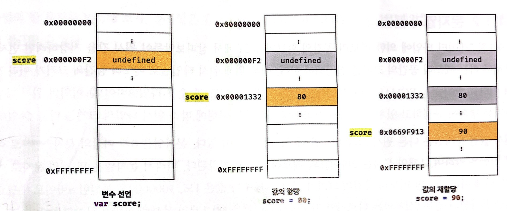
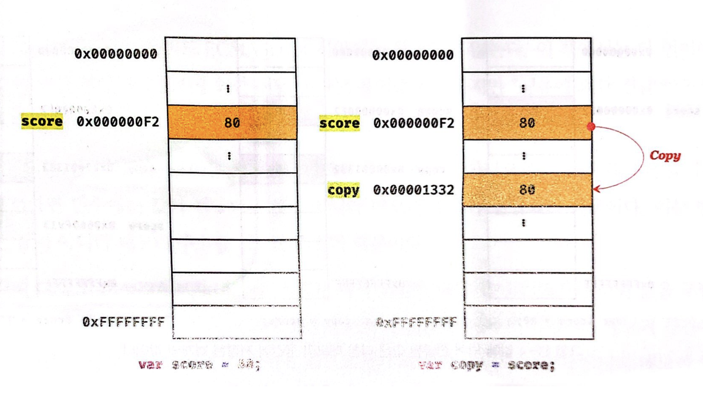
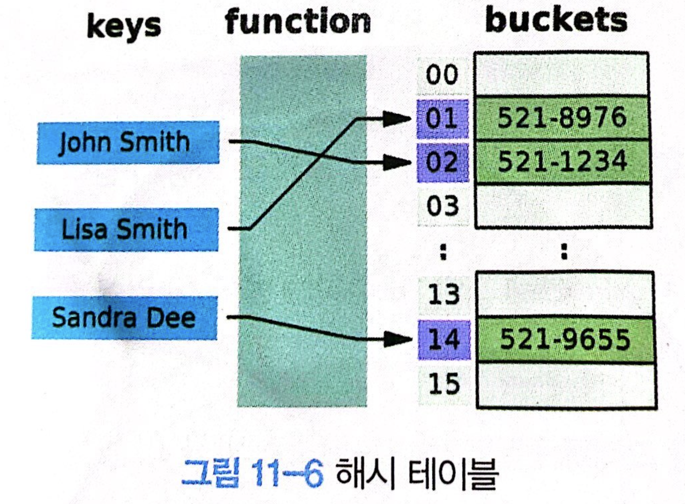
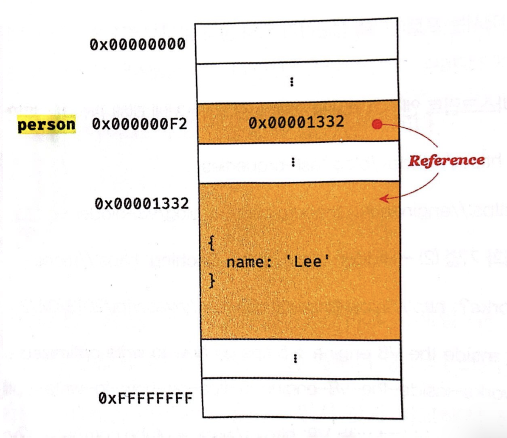
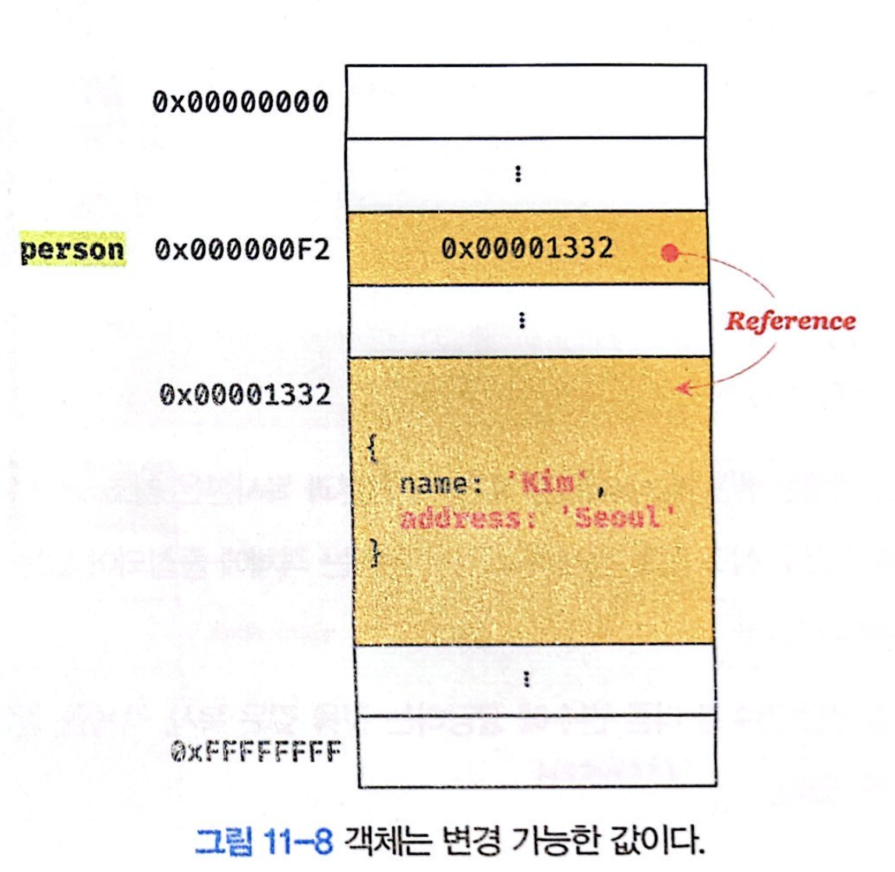
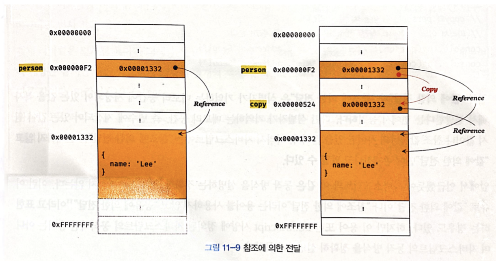

# 원시 값
**원시 타입(primitive type)** 의 값은 **변경 불가능한 값(immutable value)** 이다.  
한번 생성된 원시 값은 **read only**값으로서 변경할 수 없다.  
여기서 변경 불가능하다는 것은 변수가 아니라 값에 대한 진술이다.  
즉, 변수는 언제든지 재할당을 통해 변수 값을 변경할 수 있다.  

<div style="text-align: center;">
  
</div>

위 사진을 보면 값이 바뀌는 것이 아니라 변경된 값을 저장하는 메모리 공간을 따로 할당하고 변수가 참조하던 메모리 공간의 주소를 변경하는 것을 확인할 수 있다.

---

```js
const o = {};
o.a = 1; // 객체는 변경 가능
console.log(o); // {a : 1}
```
변수의 상대 개념인 상수(const)는 **재할당이 금지된 변수**를 말한다. 변수는 언제든지 재할당을 통해 변수 값을 변경 할 수 있지만 상수는 단 한 번만 할당이 허용되므로 변수 값을 변경할 수 없다. 

**하지만 const 키워드를 사용해 선언한 변수에 할당한 객체는 변경할 수 있다!**  
  
  원시 값은 어떤 일이 있어도 불변한다는 특성 때문에 데이터의 신뢰성을 보장한다.

## 문자열과 불변성
문자열은 원시값이지만 `유사 배열 객체`이면서 `이터러블`이므로 배열과 유사하게 각 문자에 접근할 수 있다.
```js
var str = 'string';
// 문자열은 유사 배열이므로 배열과 유사하게 인덱스를 사용해 각 문자에 접근할 수 있다.
console.log(str[0]);

//원시 값인 문자열이 객체처럼 등장한다.
console.log(str.length); // 6
console.log(str.toUpperCase()); // STRING
```
문자열 처럼 원시 값을 객체처럼 사용하면 원시 값을 감싸는 래퍼 객체로 자동 변환된다. (나중에 나오는 개념)  
  
```js
var str = 'string';
str[0] = 'S'; // 에러 발생 x
console.log(str); // string
```
문자열은 객체의 특성을 띄고 있지만 결국 원시 값이므로 불변하다.

## 값에 의한 전달
```js
var score = 80;
var copy = score;
console.log(score); // 80
console.log(copy); // 80
```
<div style="text-align: center;">
  
</div>

변수에 원수 값을 할당하면 할당받는 변수에는 할당되는 변수의 원시 값이 복사되어 전달되며 이를 **값에 의한 전달**이라고 한다.  
이때 `score` 변수와 `copy` 변수는 숫자 값 80을 갖는다는 점에서 동일하지만 다른 메모리 공간에 저장된 별개의 값이다.
```js
score = 100;
console.log(score, copy); // 100 80
```
따라서 `score`의 값이 바뀌더라도 `copy`의 값은 변하지 않는다.

# 객체
객체는 프로퍼티의 개수가 정해져 있지 않으며, 동적으로 추가되고 삭제할 수 있다. 또한 프로퍼티의 값에도 제약이 없기 때문에 객체는 원시 값과 같이 확보해야 할 메모리 공간의 크기를 사전에 정해 둘 수 없다.  
  
따라서 객체는 원시 값과는 다른 방식으로 동작하도록 설계되어 있다.

## 자바스크립트 객체의 관리 방식
<div style="text-align: center;">
  
</div>
자바스크립트 객체는 프로퍼티 키를 인덱스로 사용하는 해시 테이블이라고 생각할 수 있으나 대부분의 자바스크립트 엔진은 해시 테이블과 유사하지만 높은 성능을 위해 더 나은 방법으로 객체를 구현한다.  
  
자바스크립트의 객체는 생성된 이후에도 동적으로 프로퍼티와 메서드를 추가할 수 있다는 점에서 사용하기 매우 편리하지만 객체 생성과 프로퍼티 접근에 비용이 더 많이들게 된다.  
이를 위해 `동적 탐색(dynamic lookup)` 대신 `히든 클래스(hidden class)` 방식을 사용해 클래스 기반 객체지향 프로그래밍 언어와 프로퍼티 접근에는 비슷한 성능을 보장한다.  

## 변경 가능한 값
**객체(참조) 타입의 값**은 **변경 가능한 값(mutable value)**이다.

```js
var person = {
  name: 'Lee';
}
```
<div style="text-align: center;">
  
</div>

할당이 이뤄지는 시점에서 객체 리터럴이 해석되고, 그 결과 객체가 생성된다.  
사진을 보면 알 수 있듯이 `person`의 메모리 공간에는 객체를 담고 있는 것이 아니라 생성된 객체의 주소 값을 담고 있다.

```js
person.name = 'Kim' // 프로퍼티 값 갱신
person.adderss = 'Seoul' // 프로퍼티 동적 생성
```

<div style="text-align: center;">
  
</div>

객체는 **mutable**하기 때문에 `person` 자체의 값은 바꿀 수 없지만 `person`이 가리키고 있는 객체의 값은 접근 연산자를 사용하여 변경할 수 있다.  

## 얕은 복사와 깊은 복사
```js
const o = { x: { y: 1 } };
//얕은 복사
const c1 = { ...o };
console.log(c1 === o); // false
console.log(c1.x === o.x); // true

// lodash의 cloneDeep을 사용한 깊은 복사
// "npm install lodash"로 설치한 후, Node.js 환경에서 실행
const _ = require('lodash');
// 깊은 복사
const c2 = _.cloneDeep(o);
console.log(c2 === 0); // false;
console.log(c2.x === o.x); // false
```

객체를 프로퍼티 값으로 갖는 객체의 경우 얕은 복사는 한 단계까지만 복사하는 것을 말하고 깊은 복사는 객체에 중첩되어 있는 객체까지 모두 복사하는 것을 말한다.  
깊은 복사는 객체에 중첩되어 있는 객체까지 모두 복사해서 원시 값처럼 완전한 복사본을 만든다.

## 참조에 의한 전달
```js
var person = { name : 'Lee'};
// 참조 값을 복사(얕은 복사)
var copy = person;
```
<div style="text-align: center;">
  
</div>

객체를 가리키는 변수를 다른 변수에 할당하면 원본의 참조 값이 복사되어 전달된다. 이를 **참조에 의한 전달**이라 한다.  
**두 개의 식별자가 하나의 객체를 공유**하는 것을 확인할 수 있다.

```js
// copy와 person은 동일한 객체를 참조한다.
console.log(copy === person); // true
copy.name = 'Kim';
person.adderss = 'Seoul';

console.log(person); // {name : "Kim", address: "Seoul"}
console.log(copy); // {name : "Kim", address: "Seoul"}
```

---

### 값에 의한 전달 vs 참조에 의한 전달

값에 의한 전달과 참조에 의한 전달 모두 식별자가 기억하는 메모리 공간에 저장되어 있는 값을 복사해서 전달한다는 면에서 동일하다.  
  
차이가 있다면 식별자가 기억하는 메모리 공간에 있는 값이 원시 값이냐 참조 값이냐의 차이만 있을 뿐이다.  
  
따라서 자바스크립트에는 참조에 의한 전달은 존재하지 않고 값에 의한 전달 만이 존재한다고 할 수 있다.