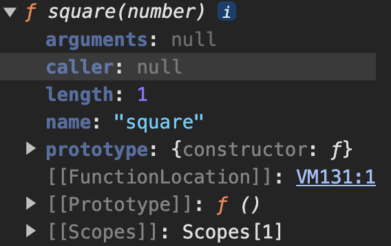

# 함수와 일급 객체
다믕과 같은 조건을 만족하는 객체를 `일급 객체`라고 한다.
1. 무명의 리터럴로 생성할 수 있다. 즉, 런타임에 생성이 가능하다.
2. 변수나 자료구조(객체, 배열 등)에 저장할 수 있다.
3. 함수의 매개변수에 전달할 수 있다.
4. 함수의 반환값으로 사용할 수 있다.

```js
// 1. 함수는 무명의 리터럴로 생성할 수 있다.
// 2. 함수는 변수에 저장할 수 있다.
// 런타임(할당 단계)에 함수 리터럴이 평가되어 함수 객체가 생성되고 변수에 할당된다.
const increase = function (num){
  return ++num;
};

const decrease = function (num){
  return --num;
}

// 2. 함수는 객체에 저장할 수 있다.
const auxs = { increase, decrease };

// 3. 함수의 매개변수에 전달할 수 있다.
// 4. 함수의 반환값으로 사용할 수 있다.
function makeCounter(aux){
  let num = 0;
  return function(){
    num = aux(num);
    return num;
  };
}

// 3. 함수는 매개변수에게 함수를 전달할 수 있다.
const increaser = makeCounter(auxs.increase);
console.log(increaser()); // 1
console.log(increaser()); // 2
```
함수가 일급 객체라는 것은 함수를 개체와 동일하게 사용할 수 있다는 의미다. 객체는 값이므로 함수는 값과 동일하게 취급할 수 있다. 따라서 함수는 값을 사용할 수 있는 곳(변수 할당문, 객체의 프로퍼티 값, 배열의 요소, 함수 호출의 인수, 함수 반환문)이라면 어디서든지 리터럴로 정의할 수 있으며 런타임에 함수 객체로 평가된다.

# 함수 객체의 프로퍼티
함수는 객체다. 따라서 함수도 프로퍼티를 가질 수 있다. 브라우저 콘솔에서 console.dir 메서드를 사용하여 함수 객체의 내부를 들여다보자.
```js
function square(number){
  return number * number;
}
console.dir(square);
```
<div style="text-align: center;">
  
</div>

```js
function square(number) {
  return number * number;
}
console.log(Object.getOwnPropertyDescriptors(square));
/*
{
  length: { value: 1, writable: false, enumerable: false, configurable: true },
  name: {
    value: 'square',
    writable: false,
    enumerable: false,
    configurable: true
  },
  arguments: {
    value: null,
    writable: false,
    enumerable: false,
    configurable: false
  },
  caller: {
    value: null,
    writable: false,
    enumerable: false,
    configurable: false
  },
  prototype: { value: {}, writable: true, enumerable: false, configurable: false }
}
*/
// __proto__는 square 함수의 프로퍼티가 아니다.
console.log(Object.getOwnPropertyDescriptor(square, '__proto__')); // undefined

// __proto__는 Object.prototype 객체의 접근자 프로퍼티다.
// square 함수는 Object.prototype 객체로부터 __proto__접근자 프로퍼티를 상속받는다.
console.log(Object.getOwnPropertyDescriptor(Object.prototype, '__proto__'));
/*
{
  get: [Function: get __proto__],
  set: [Function: set __proto__],
  enumerable: false,
  configurable: true
}
*/
```
위를 보면 할 수 있듯이 arguments, length, name, prototype 프로퍼티는 모두 함수 객체의 데이터 프로퍼티다. 이들 프로포티는 일반 객체에는 없는 함수 객체 고유의 프로퍼티다.하지만 __proto__는 접근자 프로퍼티이며, 함수 객체 고유의 프로퍼티가 아니라 Object.prototype 객체의 프로퍼티를 상속받은 것을 알 수 있다.


## arguments 프로퍼티
함수 객체의 arguments 프로퍼티 값은 arguments 객체다. arguments 객체는 함수 호출 시 전달된 인수들의 정보를 담고 있는 순회 가능한(iterable) 유사 배열 객체이며, 함수 내부에서 지역 변수처럼 사용된다.(외부 참조 불가)  
  
자바스크립트 함수의 매개변수와 인수의 개수가 일치하는지 확인하지 않는다. 따라서 함수 호출 시 매개변수 개수만큼 인수를 전달하지 않아도 에러가 발생하지 않는다.

```js
[Arguments] { '0': 1, '1': 2 }
```

arguments 객체는 인수를 프로퍼티 값으로 소유하며 프로퍼티 키는 인수의 순서를 나타낸다. arguments 객체의 callee 프로퍼티는 호출되어 arguments 객체를 생성한 함수, 즉 함수 자신을 가리키고 arguments 객체의 length 프로퍼티는 인수의 개수를 가리킨다.

  
선언된 매개변수의 개수와 함수를 호출할 때 전달하는 인수의 개수를 확인하지 않는 자바스크립트의 특성 때문에 함수가 호출되면 인수 개수를 확인하고 이에 따라 함수의 동작을 달릴 정의할 필요가 있을 수 있다.  
arguments 객체는 매개변수 개수를 확정할 수 없는 **가변 인자 함수**를 구현할 때 유용하다.
```js
function sum() {
  let res = 0;

  // arguments 객체는 length 프로퍼티가 있는 유사 배열 객체이므로 for 문으로 순회할 수 있다.
  for(let i = 0; i < arguments.length; i++){
    res += arguments[i];
  }
  return res;
}

console.log(sum()); // 0
console.log(sum(1,2)) // 3
```
arguments 객체는 배열 형태로 인자 정보를 담고 있지만 실제 배열이 아닌 유사 배열 객체다.

## caller 프로퍼티
caller 프로퍼티는 ECMAScript 사양에 포함되지 않은 비표준 프로퍼티다. 몰라도 된다.
```js
function foo(func){
  return func();
}
fucntion bar(){
  return 'caller : ' +bar.caller;
}

console.log(foo(bar)); // caller : function foo(func) 
console.log(bar()) // caller : null
```

## length 프로퍼티
함수 객체의 length 프로퍼티는 함수를 정의할 때 선언한 매개변수의 개수를 가리킨다.
```js
function bar(x){
  return x;
}
console.log(bar.length);
```
주의해야 할 점은 arguments 객체의 length 프로퍼티와 함수 객체의 length 프로퍼티의 값이 다를 수 있다는 것이다. arguments 객체의 프로퍼티는 인자의 개수를 가리키고, 함수 객체의 length 프로퍼티는 매개변수의 개수를 가리킨다.

## name 프로퍼티
함수 객체의 Name 프로퍼티는 함수 이름을 나타낸다. name 프로퍼티는 ES6 이전까지는 비표준이었다가 ES에서 정식 표준이 되었다.  
ES5와 ES6에서 name 프로퍼티의 동작은 다르다. 익명 함수 표현식의 경우 ES5에서는 빈 문자열을 갖지만 ES6에서는 함수 객체를 가리키는 식별자를 값으로 갖는다.

```js
var namedFunc = function foo() {};
console.log(namedFunc.name); // foo

// 익명 함수 표현식
var anonymousFunc = function() {};
// ES5: name 프로퍼티는 빈 문자열을 값으로 갖는다.
// ES6: name 프로퍼티는 객체를 가리키는 변수 이름을 값으로 갖는다.
console.log(anonymousFunc.name) // anonymousFunc
```

## __proto__ 접근자 프로퍼티
모든 객체는 `[[Prototype]]`이라는 내부 슬롯을 갖는다. `[[Prototype]]` 내부 슬롯은 객체지향 프로그래밍의 상속을 구현하는 프로토타입 객체를 가리킨다.

__proto__ 프로퍼티는 `[[Prototype]]` 내부 슬롯이 가리키는 프로토타입 객체에 접근하기 위해 사용하는 접근자 프로퍼티다. 내부 슬홋에는 직접 접근할 수 없고 간접적인 접근 방법을 제공하는 경우에 한하여 접근할 수 있다.
```js
const obj = { a: 1 };

// 객체 리터럴 방식으로 생성한 객체의 프로토타입 객체는 Object.prototype이다.
console.log(obj.__proto__ === Object.prototype); // true

// 객체 리터럴 방식으로 생성한 객체는 프로토타입 객체인 Object.prototype의 프로퍼티를 상속받는다.
// hasOwnProperty 메서드는 Object.protoypte의 메서드다.
console.log(obj.hasOwnProperty('a')); // true
console.log(obj.hasOwnProperty('__proto__')); // false
```

## prototype 프로퍼티
prototype 프로퍼티는 생성자 함수로 호출할 수 있는 함수 객체, 즉 constructor만이 소유하는 프로퍼티다. 일반 객체와 생성자 함수로 호출할 수 없는 non-constructor에서 prototype 프로퍼티가 없다.
```js
(function () {}).hasOwnProperty('prototype'); // -> true

// 일반 객체는 prototype 프로퍼티를 소유하지 않는다.
({}).hasOwnProperty('prototype'); // -> false
```
prototype 프로퍼티는 함수가 객체를 생성하는 생성자 함수로 호출될 때 생성자 함수가 생성할 인스턴스 프로토타입을 가리킨다.