# 프로토타입
자바스크립트는 public, private, protected 등이 없어서 자바스크립트는 객체지향 언어가 아니라고 오해하지만, 자바스크립트는 클래스 기반 객체지향 프로그래밍 언어보다 효율적이며 더 강력한 객체지향 프로그래밍 능력을 지니고 있는 프로토타비 기반의 객체지향 프로그래밍 언어다.  

# 객체 지향 프로그래밍
객체객체지향 프로그래밍은 절차지향적 관점에서 벗어나 여러 개의 독립적 단위, 즉 객체의 집합으로 프로그램을 표현하려는 프로그래밍 패러다임이다.  
객체지향 프로그래밍은 실세계의 실체를 인식하는 처락적 사고를 프로그래밍에 접목하려는 시도에서 시작한다. 실체는 특징이나 성질은 나타내는 속성을 가지고 있고, 이를 통해 실체를 인식하거나 구별할 수 있다
```js
const circle = {
  radius: 5, // 반지름
  // 원의 지름: 2r
  getDiameter(){
    return 2 * this.radius;
  },
  getPerimeter(){
    return 2 * Math.PI * this.radius;
  },
  getArea(){
    return Math.PI * this.radius ** 2;
  }
};

console.log(circle);
// {radius: 5, getDiameter: f, getPerimeter: f, getArea: f}
```

위는 원을 객체로 표현한 코드이다.  
객체지향 프로그래밍은 객체의 상태를 나타내는 데이터와 상태 데이터를 조작할 수 있는 동작을 하나의 논리적인 단위로 묶어 생각한다.  
이때 객체의 상태 데이터를 `프로퍼티`, 동작을 `메서드`라고 부른다.

# 상속과 프로토타입
상속(inheritane)은 객체지향 프로그래밍의 핵심 개념으로, 어떤 객체의 프로퍼티 또는 메서드를 다른 객체가 상속받아 그대로 사용할 수 있는 것을 말한다.  
자바스크립트는 프로토타입을 기반으로 상속을 구현하여 불필요한 중복을 제거한다.
```js
// 생성자 함수
function Circle(radius) {
  this.radius = radius;
  this.getArea = function () {
    // Math.PI는 원주율을 나타내는 상수다.
    return Math.PI * this.radius ** 2;
  };
}

// 반지름이 1인 인스턴스 생성
const circle1 = new Circle(1);
// 반지름이 2인 인스턴스 생성
const circle2 = new Circle(2);

// Circle 생성자 함수는 인스턴스를 생성할 때마다 동일한 동작을 하는
// getArea 메서드를 중복 생성하고 모든 인스턴스가 중복 소유한다.
// getArea 메서드는 하나만 생성하여 모든 인스턴스가 공유해서 사용하는 것이 바람직하다.
console.log(circle1.getArea === circle2.getArea); // false

console.log(circle1.getArea()); // 3.141592653589793
console.log(circle2.getArea()); // 12.566370614359172
```
위 코드를 사진으로 표현하면 다음과 같다.

<div style="text-align: center;">
  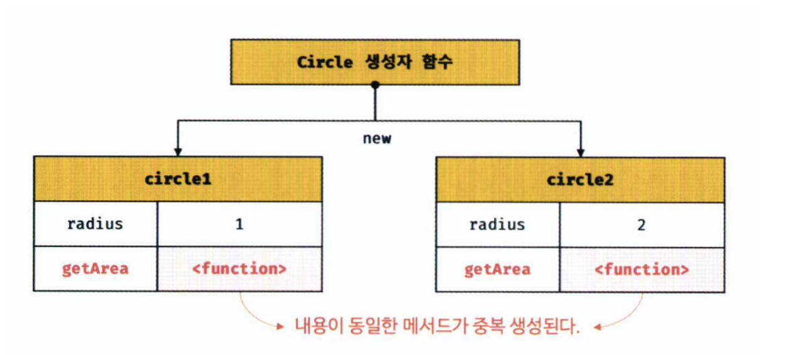
</div>

동일한 구조를 가진 두 개의 인스턴스가 생성된다.
여기서 `getArea` 메서드는 동일한 역할을 하지만 두 개가 생성되어 불필요한 공간을 차지하는 것을 알 수 있다.  
일반적으로 인스턴스마다 프로퍼티 값은 다르지만 메서드는 동일하다.  
상속을 통해 불필요한 중복을 제거할 수 있다. 자바스크립트는 프로토타입을 기반으로 상속을 구현한다.

```js
// 생성자 함수
function Circle(radius) {
  this.radius = radius;
}

// Circle 생성자 함수가 생성한 모든 인스턴스가 getArea 메서드를
// 공유해서 사용할 수 있도록 프로토타입에 추가한다.
// 프로토타입은 Circle 생성자 함수의 prototype 프로퍼티에 바인딩되어 있다.
Circle.prototype.getArea = function () {
  return Math.PI * this.radius ** 2;
};

// 인스턴스 생성
const circle1 = new Circle(1);
const circle2 = new Circle(2);

// Circle 생성자 함수가 생성한 모든 인스턴스는 부모 객체의 역할을 하는
// 프로토타입 Circle.prototype으로부터 getArea 메서드를 상속받는다.
// 즉, Circle 생성자 함수가 생성하는 모든 인스턴스는 하나의 getArea 메서드를 공유한다.
console.log(circle1.getArea === circle2.getArea); // true

console.log(circle1.getArea()); // 3.141592653589793
console.log(circle2.getArea()); // 12.566370614359172

```
위 코드를 사진으로 나타내면 다음과 같다.

<div style="text-align: center;">
  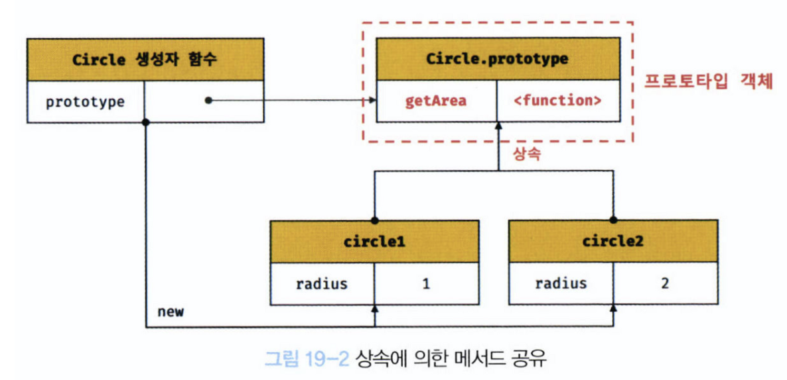
</div>

Circle 생성자 함수가 생성한 모든 인스턴스는 자신의 프로토타입, 즉 사위(부모)객체 역할을 하는 Circle, prototype의 모든 프로퍼티와 메서드를 상속받는다.  
getArea 메서드는 단 하나만 생성되어 프로토타입인 Circle.prototype의 메서드로 할당되어 있다. 즉, radius 프로퍼티만 새별적으로 소유하고 내용이 동일한 메섣는 상속을 통해 공유하여 사용하는 것이다.  

# 프로토타입 객체
프로토타입 객체란 객체지향 프로그래밍의 근간을 이루는 개체 간 상속을 구현하기 위해 사용된다. 프로토타입은 어떤 객체의 상위(부모) 객체의 역할을 하는 객체로서 다른 객체에 공유 프로퍼티(메서드 포함)를 제공한다. 프로토타입을 상속받은 하위(자식) 객체는 상위 객체의 프로퍼티를 자식의 프로퍼티처럼 자유롭게 사용할 수 있다.

<div style="text-align: center;">
  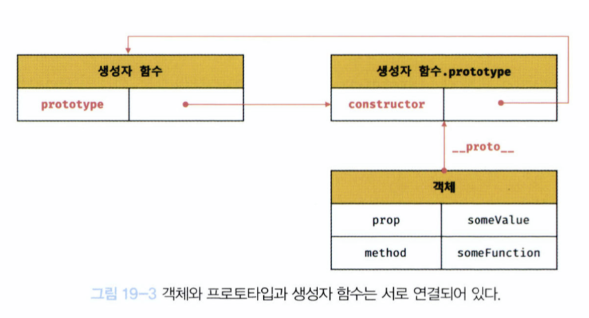
</div>  
```
모든 객체는 [[Prototype]] 이라는 내부 슬롯을 가지며, 이 내부 슬롯의 값은 프로토타입의 참조다. [[Prototype]] 내부 슬롯에는 직접 접근할 수 없지만, 위 그림처럼 __proto__ 접근자 프로퍼티를 통해 자신의 프로토타입, 즉 자신의 [[Prototype]] 내부 슬롯이 가리키는 프로토타입에 간접적으로 접근할 수 있다.  
그리고 프로토타입은 자신의 constructor 프로퍼티를 통해 생성자 함수에 접근할 수 있고, 생성자 함수는 자신의 prototype 프로퍼티를 통해 프로토타입에 접근할 수 있다.

# \_\_proto\_\_ 접근자 프로퍼티
모든 객체는 __proto__ 접근자 프로퍼티를 통해 자신의 프로토타입, 즉 [[Prototype]] 내부 슬롯에 간접적으로 접근할 수 있다.  

### \_\_proto\_\_는 접근자 프로퍼티다.
내부 슬롯은 프로퍼티가 아니다. 따라서 자바스크립트는 원칙적으로 내부 슬롯과 내부 메서드에 직접적으로 접근하거나 호출할 수 있는 방법을 제공하지 않는다.  
**[[Prototype]] 내부 슬롯에도 직접 접근할 수 없으며 __proto__ 접근자 프로퍼티를 통해 간접적으로 프로토타입에 접근할 수 있다.**  
  
Object.prototype의 접근자 프로퍼티인 __proto__는 getter/setter 함수라고 부르는 접근자 함수 ([[Get]], [[Set]] 프로퍼티 어트리뷰트에 할당된 함수)를 통해 [[Prototype]] 내부 슬롯을 값을 취득하거나 할당한다.

```js
const obj = {};
const parent = { x : 1 };

// getter 함수인 get __proto__가 호출되어 obj 객체의 프로토타입을 취득
obj.__proto__;

// setter 함수인 set __proto__가 호출되어 obj 객체의 프로토타입을 교페
obj.__proto__ = parent;

console.log(obj.x);
```

### \_\_proto\_\_ 접근자 프로퍼티는 상속을 통해 사용된다.
__proto__ 접근자 프로퍼티는 객체가 집접 소유하는 프로퍼티가 아니라 Object.prototype의 프로퍼티다. 모든 객체는 상속을 통해 Object.prototype.\_\_proto\_\_ 접근자 프로퍼티를 사용할 수 있다.

```js
const person = { name : 'Lee' };

// person 객체는 __proto__ 프로퍼티를 소유하지 않는다.
console.log(person.hasOwnProperty('__proto__')); // false

// __proto__ 프로퍼티는 모든 객체의 프로토타입 객체인 Object.prototype의 접근자 프로퍼티다.
console.log(Object.getOwnPropertyDescriptor(Object.prototype,'__proto__'));
// {get: f, set: f, enumerable: false, configurable: true}

// 모든 객체는 Object.prototype의 접근자 프로퍼티 __proto__를 상속받아 사용할 수 있다.
console.log({}.__proto__ === Object.prototype); // true
```

### \_\_proto\_\_ 접근자 프로퍼티를 통해 프로토타입에 접근하는 이유
[[Prototype]] 내부 슬롯의 값, 즉 프로토타입에 접근하기 위해 접근자 프로퍼티를 사용하는 이유는 상호 참조에 의해 프로토타입 체인이 생성되는 것을 방지하기 위해서다.

```js
const parent = {};
const child = {};

// child의 프로토타입을 parent로 설정
child.__proto__ = parent;
// parent의 프로토타입을 child로 설정
parent.__proto__ = child; // TypeError: Cyclic __proto value
```
위 코드는 서로가 서로를 가리키는 프로토타입 체인이 만들어지기 때문에 \_\_proto\_\_ 접근자 프로퍼티는 에러를 발생시킨다.  
임의로 사용자가 프로토타입 체인을 만들 수 있다면 순환 참조 프로토타입 체인을 만들 수 있기 때문에 \_\_proto\_\_를 사용하여 이를 방지한다.

### \_\_proto\_\_ 접근자 프로퍼티를 코드 내에서 직접 사용하는 것은 권장하지 않는다.

```js
// obj는 프로토타입 체인의 종점이다. 따라서 Object.__proto__를 상속받을 수 없다.
const obj = Object.create(null);

// obj는  프로토타입이 null인 객체이므로 어떤 프로토타입도 상속받지 않느다. Object.__proto__를 상속받을 수 없다.
console.log(obj.__proto__); // undefined

// 따라서 __proto__보다 Object.getPrototypeOf 메서드를 사용하는 편이 좋다.
console.log(Object.getPrototypeOf(obj)); // null
```
따라서 \_\_proto\_\_ 접근자 프로퍼티 대신 프로토타입의 참조를 취득하고 싶은 경우에는 Object.getPrototypeOf 메서드를 사용하고, 프로토타입을 교체하고 싶은 경우에는 Object.setPrototypeOf 메서드를 사용할 것을 권장한다.

```js
const obj = {};
const parent = { x: 1};

// obj 객체의 프로토타입을 취득
Object.getPrototypeOf(obj); // obj.__proto__;
// obj 객체의 프로토타입을 교체
Object.setPrototypeOf(obj, parent); // obj.__proto__ = parent;

consold.log(obj.x); //1
```
# 함수 객체의 prototype 프로퍼티
**함수 객체만이 소유하는 prototype 프로퍼티는 생성자 함수가 생성할 인스턴스의 프로토타입을 가리킨다.**  
```js
// 함수 객체는 prototype 프로퍼티를 소유한다.
(function () {}).hasOwnProperty('prototype'); // -> true

// 일반 객체는 prototype 프로퍼티를 소유하지 않는다.
({}).hasOwnProperty('prototype'); // -> false
```
```js
// 화살표 함수는 non-constructor다.
const Person = name => {
  this.name = name;
};

// non-constructor는 prototype 프로퍼티를 소유하지 않는다.
console.log(Person.hasOwnProperty('prototype')); // false

// non-constructor는 프로토타입을 생성하지 않는다.
console.log(Person.prototype); // undefined

// ES6의 메서드 축약 표현으로 정의한 메서드는 non-constructor다.
const obj = {
  foo(){}
};

// non-constructor는 prototype 프로퍼티를 소유하지 않는다.
console.log(obj.foo.hasOwnProperty('prototype')); // false

// non-constructor는 프로토타입을 생성하지 않는다.
console.log(obj.foo.prototype); // undefined
```
생성자 함수로 호출하기 위해 정의하지 않은 일반 함수(함수 선언문, 함수 표현식)도 prototype 프로퍼티를 소유하지만 객체를 생성하지 않는 일반 함수의 prototype 프로퍼티는 아무런 의미가 없다.  
  
**모든 객체가 가지고 있는(엄밀히 말하면 Object.prototype으로부터 상속받은) \_\_proto\_\_ 접근자 프로퍼티와 함수 객체만이 가지고 있는 prototype 프로퍼티는 결국 동일한 프로토타입을 가리킨다.**  
하지만 프로퍼티를 사용하는 주체가 다르다.

| 구분 | 소유 | 값 | 사용주체 | 사용목적 |
| --- | --- | --- | --- | --- |
| \_\_proto\_\_ 접근자 프로퍼티 | 모든 객체 | 프로토타입의 참조 | 모든 객체 | 객체가 자신의 프로토타입에 접근 또는 교체하기 위해 사용 |
| prototype 프로퍼티 | constructor | 프로토타입의 참조 | 생성자 함수 | 생성자 함수가 자신이 생성할 객체(인스턴스)의 프로토타입을 할당하기 위해 사용|

```js
// 생성자 함수
function Person(name) {
  this.name = name;
}

const me = new Person('Lee');

// 결국 Person.prototype과 me.__proto__는 결국 동일한 프로토타입을 가리킨다.
console.log(Person.prototype === me.__proto__); // true
```
<div style="text-align: center;">
  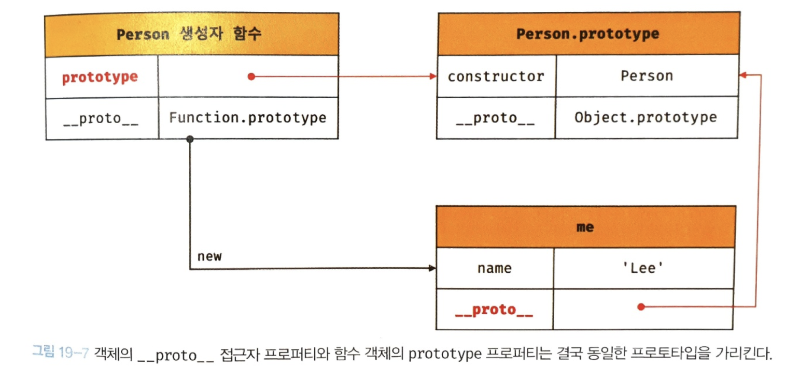
</div> 

# 프로토타입의 constructor 프로퍼티와 생성자 함수
모든 프로토타입은 constructor 프로퍼티를 갖는다. 이 constructor 프로퍼티는 prototype 프로퍼티로 자신을 참조하고 있는 생성자 함수를 가리킨다. 이 연결은 생성자 함수가 생성될 때, 즉 함수 객체가 생성될 때 이뤄진다.

```js
// 생성자 함수
function Person(name){
  this.name = name;
}

const me = new Person('Lee');

// me 객체의 생성자 함수는 Person이다.
console.log(me.constructor === Person ); // ture
```
me 객체에는 constructor 프로퍼티가 없지만 me 객체의 프로토타입인 Person.prototype에는 constructor 프로퍼티가 있다. 따라서 me 객체는 프로토타입인 Person.prototype의 constructor 프로퍼티를 상속받아 사용할 수 있다.
<div style="text-align: center;">
  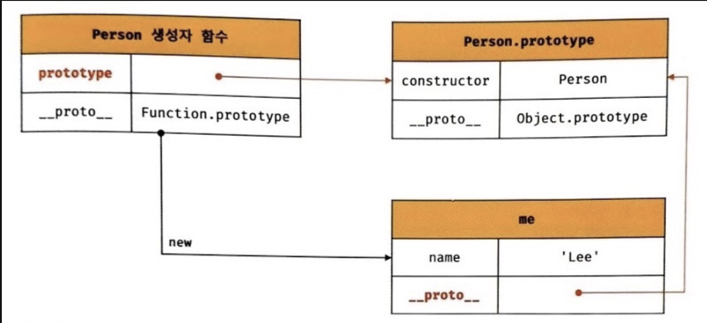
</div> 

# 리터럴 표기법에 의해 생성된 객체의 생성자 함수와 프로토타입
생성자 함수에 의해 생성된 인스턴스는 프로토타입이 `constructor` 프로퍼티에 의해 생성자 함수와 연결된다. 이때 `constructor` 프로퍼티가 가리키는 생성자 함수는 인스턴스를 생성한 생성자 함수다.
```js
// obj 객체를 생성한 생성자 함수는 Object다.
const obj = new Object();
console.log(obj.constructor == Object); // true

// add 함수 객체를 생성한 생성자 함수는 Function이다.
const add = new Function('a', 'b', 'return a + b');
console.log(add.constructor === Function);

// 생성자 함수
function Person(name){
  this.name = name;
}

// me 객체를 생성한 생성자 함수는 Personㅇ다.
const me = new Person('Lee');
console.log(me.constructor === Person); // true
```

하지만 리터럴 표기법에 의한 객체 생성 방식과 같이 명시적으로 new 연산자와 함께 생성자 함수를 호출하여 인스턴스를 생성하지 않는 방식도 있다. 리터럴 표기법에 의해 생성된 객체도 물론 프로토타입이 존재하지만 이 경우 프로토타입의 `constructor` 프로퍼티가 가리키는 생성자 함수가 반드시 객체를 생성한 생성자 함수라고 할 수 없다.
```js
// obj 객체는 Object 생성자 함수로 생성한 객체가 아니라 객체 리터럴로 생성했다.
const obj = {};

// 하지만 obj 객체의 생성자 함수는 Object 생성자 함수다.
console.log(obj.constructor === Object); // true
```
> Object 생성자 함수에 인수를 전달하지 않거나 `undefined` 또는 `null`을 인수로 전달하면서 호출하면 내부적으로는 추상 연산 `OrdinaryObjectCreate`를 호출하여 `Object.prototype`을 프로토타입으로 갖는 객체를 생성한다.

```js
// Object 생성자 함수에 의한 객체 생성
// 인수가 전달되지 않았을 때 추상연산 OrdinaryObjectCreate를 호출하여 빈 객체를 생성한다.
let obj = new Object();
console.log(obj); // {}

// 1. new.target이 undefined나 Object가 아닌 경우
// 인스턴스 -> Foo.prototype -> Object.prototype 순으로 프로토타입 체인이 생성된다.
class Foo extends Object {}
new Foo(); // Foo {}

// 3. 인수가 전달된 경우에는 인수를 객체로 변환한다.
// Number 객체 생성
obj = new Object(123);
console.log(obj); // Number {123}

// String 객체 생성
obj = new Object('123');
console.log(obj); // String {"123"}
```
Object 생성자 함수 호출과 객체 리터럴의 평가는 추상 연산 `OrdinaryObjectCreate`를 호출하여 빈 객체를 생성하는 점에서 동일하나 `new.target`의 확인이나 프로퍼티를 추가하는 처리 등 세부 내용은 다르다.

```js
// foo 함수는 Function 생성자 함수로 생성한 함수 객체가 아니라 함수 선언문으로 생성했다.
function foo() {}

// 하지만 constructor 프로퍼티를 통해 확인해보면 함수 foo의 생성자 함수는 Function 생성자 함수다.
console.log(foo.constructor === Function); // true
```
리터넌 표기법에 의해 생성된 객체도 상속을 위해 프로토타입이 필요하다. 따라서 리터럴 표기법에 의해 성성된 객체도 가상적인 생성자 함수를 갖는다. **프로토타입과 생성자 함수는 단독으로 존재할 수 없고 언제나 prototype, constructor 쌍으로 존재한다.**
|리터럴 표기법|생성자 함수|프로토타입|
|---|---|---|
|객체 리터럴|Object|Object.prototype|
|함수 리터럴|Function|Function.prototype|
|배열 리터럴|Array|Array.prototype|
|정규 표현식 리터럴|RegExp|RegExp.prototype|

# 프로토타입의 생성 시점
**프로토타입은 생성자 함수가 생성되는 시점에 더불어 생성된다.** 프로토타입과 생성자 함수는 단독으로 존재할 수 없고 항상 쌍으로 존재하기 때문이다.
### 사용자 정의 생성자 함수와 프로토타입 생성 시점
**생성자 함수로서 호출할 수 있는 함수, 즉 constructor는 함수 정의가 평가되어 함수 객체를 생성하는 시점에 프로토타입도 더불어 생성된다.**
```js
// 함수 정의(constructor)가 평가되어 함수 객체를 생성하는 시점에 프로토타입도 더불어 생성된다.
console.log(Person.prototype); // {constructor: f}

// 생성자 함수
function Person(name){
  this.name = name;
}
```
```js
// 생성자 함수로서 호출할 수 없는 함수, 즉 non-constructor는 프로토타입이 생성되지 않는다.
const Person = name => {
  this.name = name;
}

// non-constructor는 프로토타입이 생성되지 않는다.
console.log(Person.prototype);
```

<div style="text-align: center;">
  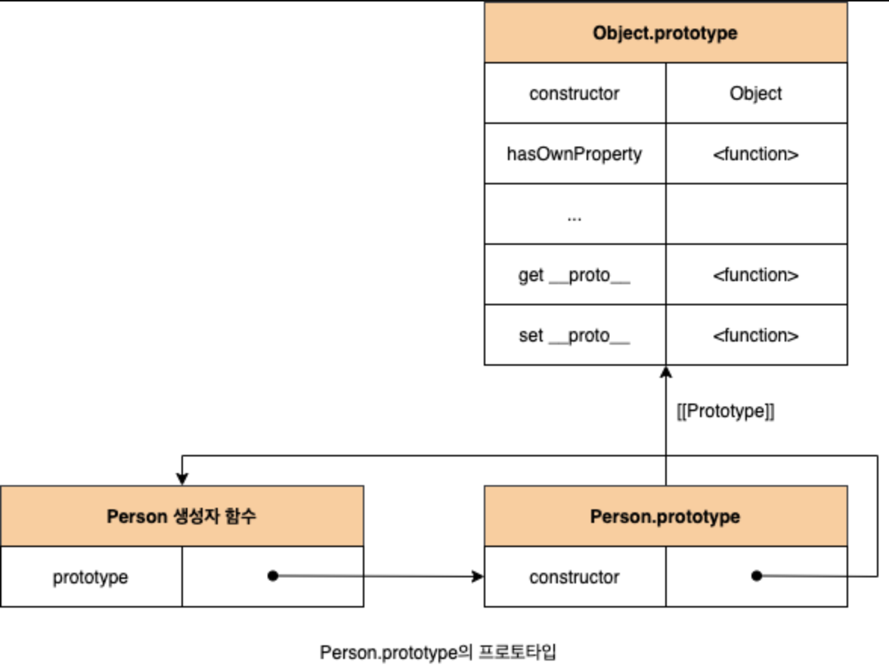
</div>

함수 선언문은 런타임 이전에 자바스크립트 엔진에 의해 먼저 실행되기 때문에 어떤 코드보다 먼저 평가되어 함수 객체가 된다. 이때 프로토타입도 생성되며 생성자 함수의 prototype 프로퍼티에 바인딩된다.  
생성된 프로토타입은 오직 constructor 프로퍼티만을 갖는 객체다. 프로토타입도 객체이고 모든 객체는 프로토타입을 가지므로 프로토타입도 자신의 프로토타입을 갖는다.  
빌트인 생성자 함수가 아닌 사용자 정의 생성자 함수의 생성된 프로토타입은 언제나 `Object.prototype`이다.

### 빌트인 생성자 함수와 프로토타입 생성 시점
Object, String, Number, Function, Array, RegExp, Date, Promise 등과 같은 빌트인 생성자 함수도 일반함수와 마찬가지로 빌트인 생성자 함수가 생성되는 시점에 프로토타입이 생성된다. 모든 빌트인 생성자 함수는 전역 객체가 생성되는 시점에 생성된다. 생성된 프로토타입은 빌트인 생성자 함수의 prototype 프로퍼티에 바인딩 된다.  

**이후 생성자 함수 또는 리터럴 표기법으로 객체를 생성하면 프로토타입은 생성된 객체의 [[Prototype]] 내부 슬롯에 할당된다.**

# 객체 생성 방식과 프로토타입의 결정
객체 생성 방식은 여러 가지가 있다.
- 객체 리터럴
- Object 생성자 함수
- 생성자 함수
- Object.create 메서드
- 클래스(ES6)
위 방식 모두 세부적인 객체 생성 방식의 차이는 있으나 추상 연산 `OrdinaryObjectCreate`에 의해 생성된다. 프로토타입은 추상 연산 `OrdinaryObjectCreate`에 전달되는 인수에 의해 결정된다. 이 인수는 객체가 생성되는 시점에 객체 생성 방식에 의해 결정된다.  

### 객체 리터럴에 의해 생성된 객체의 프로토타입
자바스크립트 엔진은 객체 리터럴을 평가하여 객체를 생성할 때 추상 연산 OrdinaryObjectCreate를 호출한다. 이때 추상 연산 OrdinaryObjectCreate에 전달되는 프로토타입은 Object.prototype이다.

<div style="text-align: center;">
  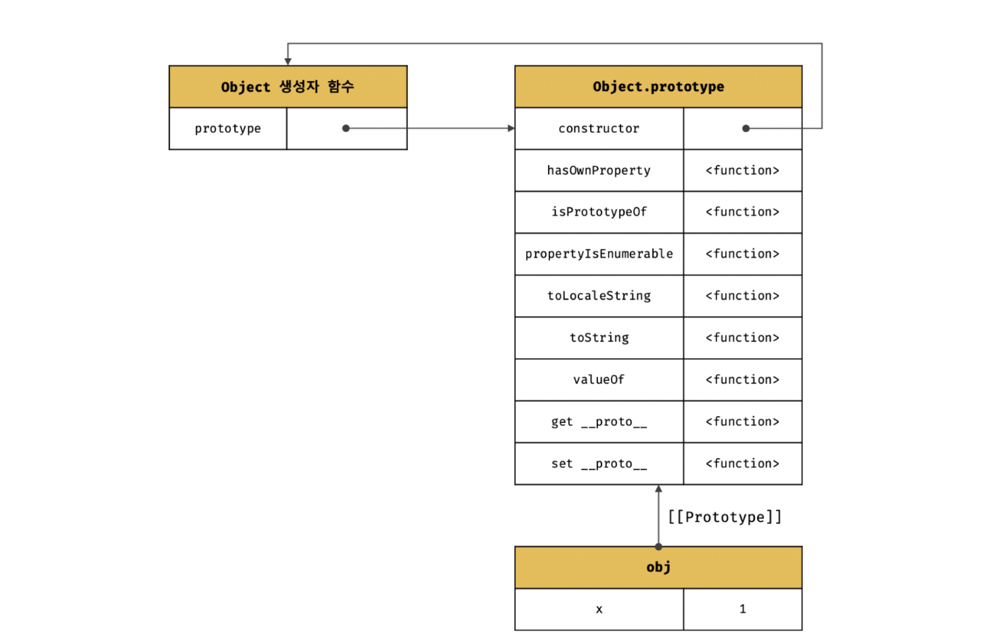
</div>

이처럼 객체 리터럴에 의해 생성된 obj 객체는 object.prototype을 프로토타입으로 갖게 되며, 이로서 Object.prototype을 상속받는다. obj 객체는 constructor 프로퍼티와 hasOwnProperty 메서드 등을 소유하지 않지만 자신의 프로토타입인 Object.prototype의 construtor 프로퍼티와 hasOwnProperty 메서드를 자신의 자산인 것처럼 사용할 수 있다.  

```js
const obj = { x : 1};

// 객체 리터럴에 의해 생성된 obj 객체는 Object.prototype을 상속받는다.
console.log(obj.constructor === Object); // true
console.log(obj.hasOwnProperty('x')); // true
```
### Object 생성자 함수에 의해 생성된 객체의 프로토타입

Object 생성자 함수를 인수 없이 호출하면 빈 객체가 생성된다. Object 생성자 함수를 호출하면 객체 리터럴과 마찬가지로 추상 연산 OrdinaryObjectCreate가 Object.prototype을 인수로 갖고 호출된다.

```js
const obj = new Object();
obj.x = 1;
```

<div style="text-align: center;">
  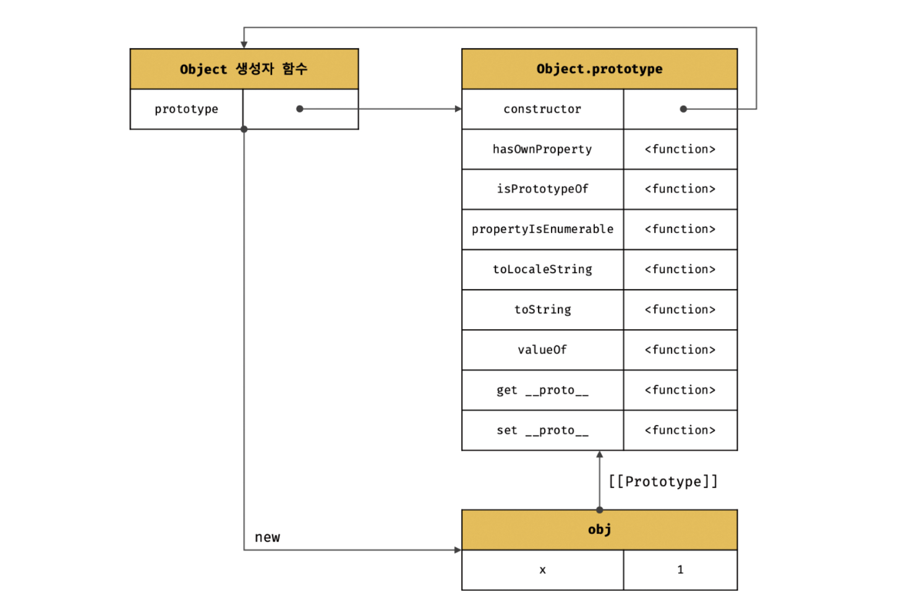
</div>

객체 리터럴에 의해 생성된 객체와 동일한 구조를 갖지만 프로퍼티를 추가하는 방식에는 차이가 있다. 객체 리터럴 방식은 객체 리터럴 내부에 프로퍼티를 추가하지만 Object 생성자 함수 방식은 일단 빈 객체를 생성한 이후 프로퍼티를 추가해야 한다.  

### 생성자 함수에 의해 생성된 객체의 프로토타입
`new` 연산자와 함께 생성자 함수를 호출하여 인스턴스를 생성하면 다른 객체 생성 방식과 마찬가지로 추상 연산 OrdinaryObjectCreate가 호출된다. 이때 추상 연산 OrdinaryObjectCreate에 전달되는 프로토타입은 생성자 함수의 prototype 프로퍼티에 바인딩되어 있는 객체다.

<div style="text-align: center;">
  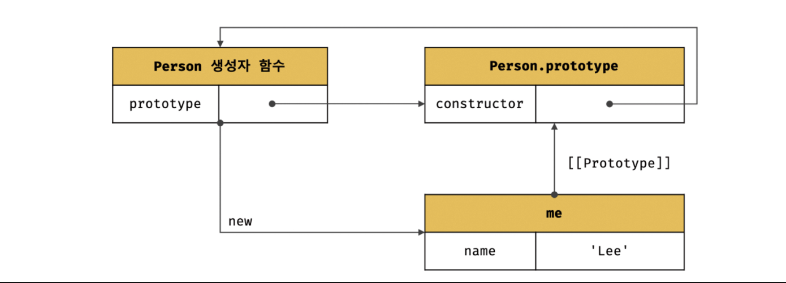
</div>

위 코드가 실행되면 추상 연산 OrdinaryObjectCreate에 의해 위와 같이 생성자 함수와 생성자 함수의 prototype 프로퍼티에 바인딩되어 있는 객체와 생성된 객체 사이에 연결이 만들어진다.
**표준 빌트인 객체인 Object 생성자 함수와 더불어 생성된 프로토타입 Object.prototype은 다양한 빌트인 메서드를 가지고 있지만 사용자 정의 생성자 함수 Person과 더불어 생성된 프로토타입 Person.prototype의 프로퍼티는 constructor 뿐이다.**
  
```js
function Person(name){
  this.name = name;
}

// 프로토타입 메서드
Person.prototype.sayHello = function () {
  console.log(`Hi! My name is ${this.name}`);
};

const me = new Person('Lee');
const you = new Person('Kim');

me.sayHello(); // Hi! My name is Lee
you.sayHello(); // H1! My name is Kim
```

<div style="text-align: center;">
  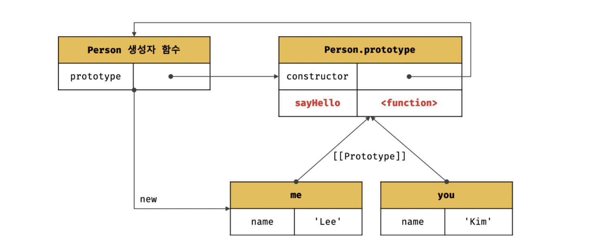
</div>
프로토타입도 객체이므로 일반 객체와 같이 프로토타입에도 프로퍼티를 추가/삭제 할 수 있다. 추가/삭제된 프로퍼티는 프로토타입 체인에 즉각 반영된다. Person 생성자 함수를 통해 생성된 모든 객체는 프로토타입에 추가된 sayHello 메서드를 상속받아 자신의 메서드처럼 사용할 수 있다.

# 프로토타입 체인
```js
function Person(name) {
  this.name = name;
}

// 프로토타입 메서드
Person.prototype.sayHello = function () {
  console.log(`Hi! My name is ${this.name}`);
};

const me = new Person('Lee');

// hasOwnProperty는 Object.prototype의 메서드다.
console.log(me.hasOwnProperty('name')); // true
```
Person 생성자 함수에 의해 생성된 me 객체는 Object.prototype의 메서드인 hasOwnProperty를 호출할 수 있다. 이것은 me 객체가 Person.prototype뿐만 아니라 Object.prototype도 상속받았다는 의미이다.

```js
Object.getPrototypeOf(me) === Person.prototype; // true

// Person.prototype의 프로토타입은 Object.prototype이다.
// 프로토타입의 프로토타입은 언제나 Object.prototype이다.
Object.getPrototypeOf(Person.prototype) == Object.prototype; // -> true
```

<div style="text-align: center;">
  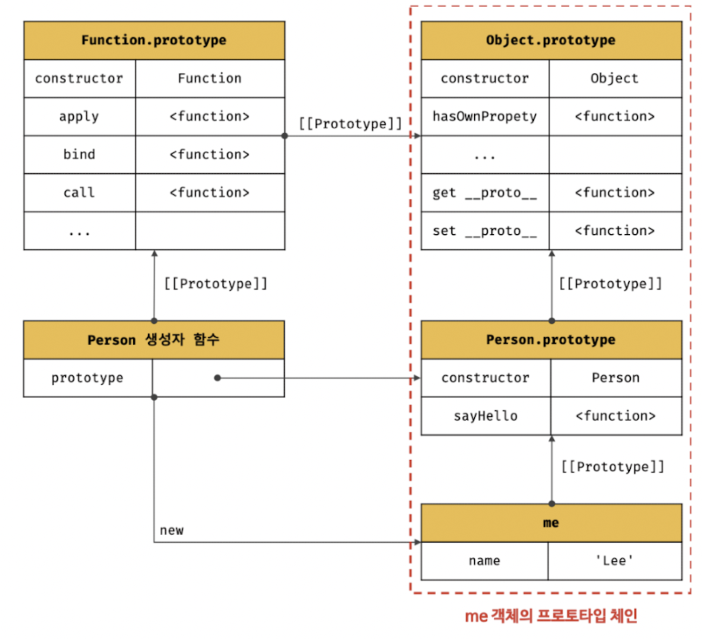
</div>

**자바스크립트는 객체의 프로퍼티(메서드 포함)에 접근하려고 할 때 해당 객체에 접근하려는 프로퍼티가 없다면 [[Prototype]] 내부 슬롯의 참조를 따라 자신의 부모 역할을 하는 프로토타입의 프로퍼티를 순차적으로 검색한다. 이를 `프로토타입 체인` 이라고 한다.**
  
프로토타입 체인의 최상위에 위치하는 객체는 언제나 Object.prototype이다. 따라서 **Object.prototype을 프로토타입 체인의 종점(end of prototype chain)** 이라고 한다.

프로퍼티는 프로토타입 체인을 통해 찾지만 프로퍼티가 아닌 식별자는 스코프 체인에서 검색한다. **스코프 체인은 식별자 검색을 위한 메커니즘** 이라고 할 수 있다.

```js
me.hsaOwnProperty('name');
```
위 예제의 경우, 먼저 스코프 체인에서 me 식별자를 검색한다. me 식별자는 스코프 체인을 통해 검색하고 me 객체의 프로토타입 체인에서 hasOwnProperty 메서드를 검색한다.  
**이처럼 스코프 체인과 프로토타입 체인은 서로 연관없이 별도로 동작하는 것이 아니라 서로 혀볅하여 식별자와 프로퍼티를 검색하는 데 사용된다.**

# 오버라이딩과 프로퍼티 섀도잉
```js
const Person = (function(){
  // 생성자 함수
  function Person(name) {
    this.name = name;
  }

  // 프로토타입 메서드
  Person.prototype.sayHello = function(){
    console.log(`Hi! My name is ${this.name}`);
  };

  // 생성자 함수를 반환
  return Person;
}());

const me = new Person('Lee');

// 인스턴스 메서드
me.sayHello = function(){
  console.log(`Hey! My name is ${this.name}`);
};

// 인스턴스 메서드가 호출된다. 프로토타입 메서드는 인스턴스 메서드에 의해 가려니다.
me.sayHello(); // Hey! My name is Lee
```
생성자 함수로 객체(인스턴스)를 생성한 다음, 인스턴스에 메서드를 추가했다.

<div style="text-align: center;">
  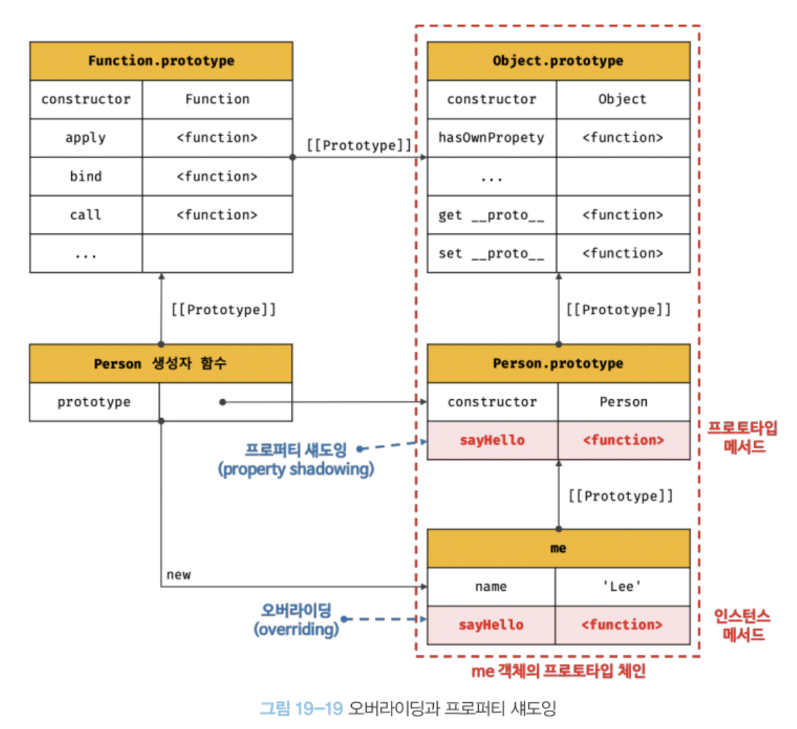
</div>

> 오버라이딩 : 상위 클래스가 가지고 있는 메서드를 하위 클래스가 재정의하여 사용하는 방식

> 프로퍼티 섀도딩 : 상속 관계에 의해 프로퍼티가 가려지는 현상을

```js
// 인스턴스 메서드를 삭제한다.
delete me.sayHello;
// 인스턴스에는 sayHello 메서드가 없으므로 프로토타입 메서드가 호출된다.
me.sayHello(); // Hi! My name is Lee
```
프로토타입 메서드가 아닌 인스턴스 메서드 sayHello가 삭제된다.

```js
// 프로토타입 체인을 통해 프로토타입 메서드가 삭제되지 않는다.
delete me.sayHello;
//프로토타입 메서드가 호출뢴다.
me.sayHello(); // Hi! My name is Lee
```
위 처럼 하위 객체를 통해 프로퍼티를 변경 또는 삭제하는 것은 불가능하다.즉, 하위 객체를 통해 프로토타입에 get 엑세스는 허용되나 set액세스는 허용되지 않는다.

```js
Person.prototye.sayHello = function(){
  console.log(`Hey! My name is ${this.name}`);
};
me.sayHello(); // Hey! My name is Lee\

// 프로토타입 메서드 삭제
delete Person.prototye.sayHello;
me.sayHello(); // TypeError: me.sayHello is not a function
```
프로토타입 프로퍼티를 변경 또는 삭제하려면 하위 객체를 통해 프로토타입 체인으로 접근하는 것이 아니라 프로토타입에 직접 접근해야한다.  

# 프로토타입의 교체
프로토타입은 임의의 다른 객체로 변경할 수 있다. 이것은 부모 객체인 프로토타입을 동적으로 변경할 수 있다는 것을 의미한다. 이러한 특징을 활용하여 객체 간의 상속 관게를 동적으로 변경할 수 있다. 프로토타입은 생성자 함수 또는 인스턴스에 의해 교체할 수 있다.

### 생성자 함수에 의한 프로토타입의 교체
```js
const Person = (function(){
  function Person(name) {
    this.name = name;
  }

  // 1. 생성자 함수의 prototype 프로퍼티를 통해 프로토타입을 교체
  Person.prototype = {
    sayHello(){
      console.log(`Hi! My name is ${this.name}`);
    }
  };

  return Person;
}());

const me = new Person('Lee');
```
1에서 Person.prototype에 객체 리터럴을 할당했다. 이는 Person 생성자 함수가 생성할 객체의 프로토타입을 객체 리터럴로 교체한 것이다.

<div style="text-align: center;">
  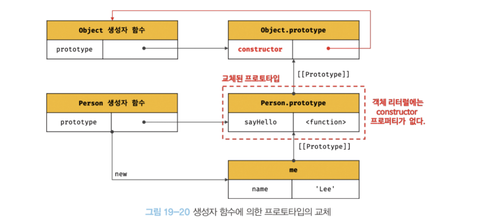
</div>

프로토타입으로 교체한 객체 리터럴에는 constructor 프로퍼티가 없다. constructor 프로퍼티는 자바스크립트 엔진이 프로토타입을 생성할 때 암묵적으로 추가한 프로퍼티다. 따라서 me 객체의 생성자 함수를 검색하면 Person이 아닌 Object가 나온다.

```js
// 프로토타입을 교체하면 constructor 프로퍼티와 생성자 함수 간의 연결이 파괴된다.
console.log(me.constructor === Person); // false
// 프로토타입 체인을 따라 Object.prototype의 constructor 프로퍼티가 검색된다.
console.log(me.constructor === Object); // true
```

### 인스턴스에 의한 프로토타입의 교체
프로토타입은 생성자 함수의 prototype 프로퍼티뿐만 아니라 인스턴스의 \_\_proto\_\_ 접근자 프로퍼티 또는 Object.getPrototypeOf 메서드를 통해 접근할 수 있다. 따라서 인스턴스의 \_\_proto\_\_ 프로퍼티 또는 Object.setPrototypeOf 메서드를 통해 프로토타입을 교체할 수 있다.
```js
function Person(name){
  this.name = name;
}

const me = new Person('Lee');

// 프로토타입으로 교체할 객체
const parent = {
  sayHello(){
    console.log(`Hi! My name is ${this.name}`);
  }
};

// 1. me 객체의 프로토타입을 parent 객체로 교체한다.
Object.setPrototypeOf(me, parent);
// 위 코드는 아래의 코드와 동일하게 동작한다.
// me.__proto__ = parent;

me.sayHello(); // Hi! My name is Lee
```
<div style="text-align: center;">
  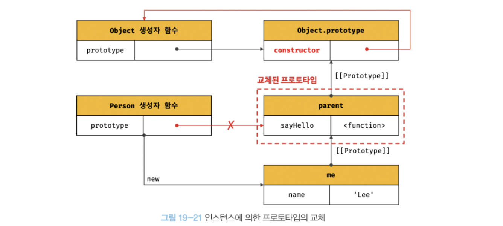
</div>

**생성자 함수에 의한 프로토타입의 교체와 비슷하지만 Person 생성자 함수의 prototype 프로퍼티가 더 이상 교체된 프로토타입을 가리키지 않는다는 차이가 있다.**

# instanceof 연산자
instanceof 연산자는 이항 연산자로서 좌변에는 개체를 가리키는 식별자, 우변에는 생성자 함수를 가리키는 식별자를 피연산자로 받는다.  
```js
객체 instanceof 생성자 함수
```

```js
// 생성자 함수
function Person(name) {
  this.name = name;
}

const me = new Person('Lee');

// Person.prototype이 me 객체의 프로토타입 체인 상에 존재하므로 true로 평가 된다.
console.log(me instanceof Person); // true

// Object.prototye이 me 객체의 프로토타입 체인 상에 존재하므로 true로 평가된다.
console.log(me instanceof Object); // true
```
<div style="text-align: center;">
  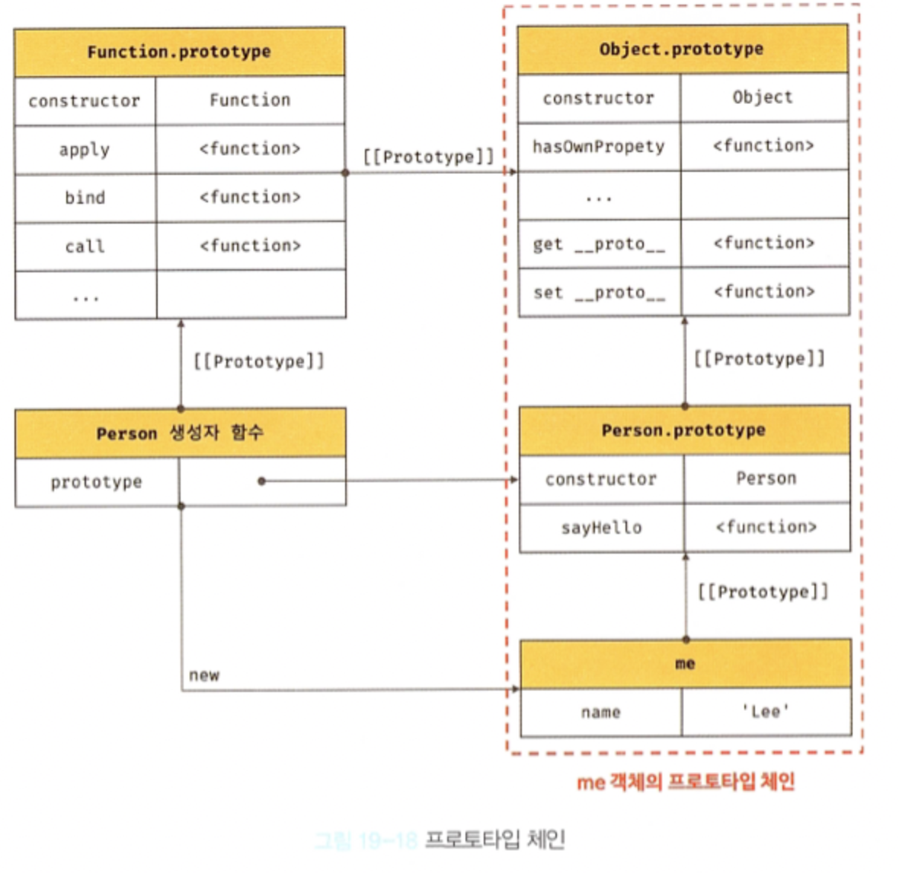
</div>

instanceof 연산자는 프로토타입의 constructor 프로퍼티가 가리키는 생성자 함수를 찾는 것이 아니라 **생성자 함수의 prototype에 바인딩된 객체가 프로토타입 체인 상에 존재하는지 확인한다.**

# 직접 상속
### Object.create에 의한 직접 상속
Object.create 메서드는 명시적으로 프로토타입을 지정하여 새로운 객체를 생성한다. Object.create 메서드도 다른 객체 생성 방식과 마찬가지로 추산 연산 OrdinaryObjectCreate를 호출한다.  

Object.create 메서드의 첫 번째 매개변수에는 생성할 객체의 프로토타입으로 지정할 객체를 전달한다. 두번째 매개변수에는 생성할 객체의 프로퍼티 키와 프로퍼티 디스크립터 객체로 이뤄진 객체를 전달한다.

```js
// 프로토타입이 null인 객체를 생성한다. 생성된 객체는 프로토타입 체인의 종점에 위치한다.
// obj -> null
let obj = Object.create(null);
console.log(Object.getPrototypeOf(obj) === null); // true
// Object.prototype을 상속받지 못한다.
console.log(obj.toString()); // TypeError

// obj -> Object.prototype -> null
// obj = {}; 와 동일하다.
obj = Object.create(Object.prototype);
console.log(Object.getPrototyeOf(obj) === Object.prototype); // true

// obj -> Object.prototype -> null
// obj = { x: 1 };와 동일하다.
obj = Object.create(Object.prototye,{
  x: { value: 1, writable: true, enumerable: true, configurable: true }
});

// 위 코드는 아래와 동일하다.
// obj = Object.create(Object.prototype);
// obj.x = 1;
console.log(obj.x);
console.log(Object.getPrototypeOf(obj) === Object.prototype); // true

const myProto = { x: 10 };
// 임의의 객체를 직접 상속받는다.
// obj -> myProto -> Object.prototype -> null
obj = Object.create(myProto);
console.log(obj.x); // 10
console.log(Object.getPrototypeOf(obj) === myProto); // true

// 생성자 함수
function Person(name){
  this.name = name;
}

// obj -> Person.prototype -> Object.prototype -> null
// obj = new Person('Lee')와 동일하다
obj = Object.create(Person.prototype);
obj.name = 'Lee';
console.log(obj.name); // Lee
console.log(Object.getPrototyeOf(obj) === Person.prototype); // true
```
직접 상속의 장점은 다음과 같다.
- new 연산자 없이도 객체를 생성할 수 있다.
- 프로토타입을 지정하면서 객체를 생성할 수 있다.
- 객체 리터럴에 의해 생성된 객체도 상속받을 수 있다.

### 객체 리터럴 내부에서 \_\_proto\_\_에 의한 직접 상속
\_\_proto\_\_를 사용하여 직접 상속을 구현할 수 있다.

```js
const myProto = { x: 10 };
// 객체 리터럴에 의해 객체를 생성하면서 프로토타입을 지정하여 직접 상속받을 수 있다.
const obj = {
  y: 20,
  // 객체를 직접 상속받는다.
  // obj -> myProto -> Object.prototype -> null
  __proto__: myProto
};
/* 위 코드는 아래와 동일하다.
const obj = Object.create(myProto,{
  y: { value: 20, writable: true, enumerable: true, configurable: true}
})
*/

console.log(obj.x,obj.y); // 10 20
console.log(Object.getPrototypeOf(obj) === myProto); // true
```
# 정적 프로퍼티/메서드
정적(static) 프로퍼티/메서드는 생성자 함수로 인스턴스를 생성하지 않아도 참조/호출할 수 있는 프로퍼티/메서드를 말한다.

```js
// 생성자 함수
function Person(name){
  this.name = name;
}

// 프로토타입 메서드
Person.prototype.sayHello = function () {
  console.log(`Hi! My name is ${this.name}`);
};

// 정적 프로퍼티
Person.staticProtp = 'static prop';

// 정적 메서드
Person.staticMethod = function(){
  console.log('staticMethod');
};

const me = new Person('Lee');

// 생성자 함수에 추가한 정적 프로퍼티/메서드는 생성자 함수로 참조/호출한다.
Person.staticMethod(); // staticMethod

// 정적 프로퍼티/메서드는 생성자 함수가 생성한 인스턴스로 참조/호출할 수 없다.
// 인스턴스로 참조/호출할 수 있는 프로퍼티/메서드는 프로토타입 체인 상에 존재해야 한다.
me.staticMethod(); // TypeError
```
Person 생성자 함수 객체가 소유한 프로퍼티/메서드를 정적 프로퍼티/메서드라고 한다. 정적 프로퍼티/메서드는 인스턴스로는 참조/호출할 수 없다.


<div style="text-align: center;">
  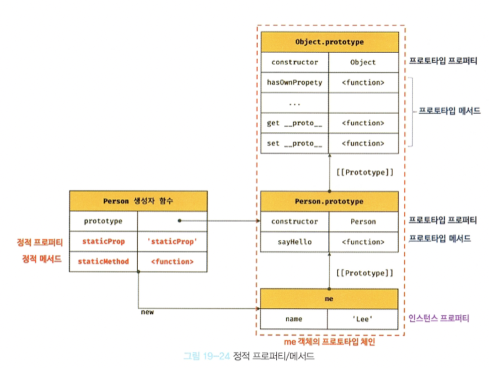
</div>

# 프로퍼티 열거
### for...in문
객체의 모든 프로퍼티를 순회하며 열거(enumeration)하려면 for...in 문을 사용한다.
>for (변수선언문 in 객체){...}

```js
const person = {
  name: 'Lee',
  address: 'Seoul'
};

// for...in 문의 변수 key에 person 객체의 프로퍼티 키다 할당된다.
for (const key in person){
  console.log(key + ': ' + person[key]);
}
// name: Lee
// address: Seoul
```
`for...in` 문은 순회 대상 객체의 프로퍼티뿐만 아니라 상속받은 프로토타입의 프로퍼티까지 열거한다. 하지만 위 예제의 경우 `toString`과 같은 `Object.prototype`의 프로퍼티가 열거되지 않는다.  
  
그 이유는 `toString` 메서드가 열거할 수 없도록 정의되어 있는 프로퍼티이기 때문이다.([[Enumerable]]의 값이 false)

배열에는 `for...in` 문을 사용하지 말고 일반적인 for 문이나 `for...of` 문 또는 `Array.prototype.forEach` 메서드를 사용하는 것이 좋다.

```js
const arr = [1,2,3];
arr.x = 10; // 배열도 객체이므로 프로퍼티를 가질 수 있다.
for (const i in arr){
  // 프로퍼티 x도 출력된다.
  console.log(arr[i]); // 1 2 3 10
};

// arr.length는 3이다.
for( let i = 0; i < arr.length; i++){
  console.log(arr[i]); // 1 2 3
}

// forEach 메서드는 요소가 아닌 프로퍼티는 제외한다.
arr.forEach(v => console.log(v)); // 1 2 3

// for...of는 변수 선언문에서 선언한 변수에 키가 아닌 값을 할당한다.
for (const value of arr){
  console.log(value); // 1 2 3
}
```
### Object.keys/values/entries 메서드
객체 자신의 고유 프로퍼티만 열거하기 위해서는 for...in 문을 사용하는 것보다 Object.keys/values/entries 메서드를 사용하는 것이 좋다.

Object.keys 메서드는 객체 자신이 열거 가능한 프로퍼티 키를 배열로 반환한다.  

```js
const person = {
  name: 'Lee',
  address: 'Seoul',
  __proto__:{ age: 20}
};

console.log(Object.keys(person)); // ["name", "addresss"]
```

Object.values 메서드는 객체 자신의 열거 가능한 프로퍼티 값을 배열로 반환한다.
```js
console.log(Object.values(person)); // ["Lee", "Seoul"]
```

Object.entries 메서드는 객체 자신의 열거 가능한 프로퍼티 키와 값의 쌍의 배열을 배열에 담아 반환한다.
```js
console.log(Object.entries(person)); // [["name", "Lee"], ["address", "Seoul"]],

Object.entries(person).forEach(([key,value]) => console.log(key, value));
/*
name Lee
address Seoul
*/
```