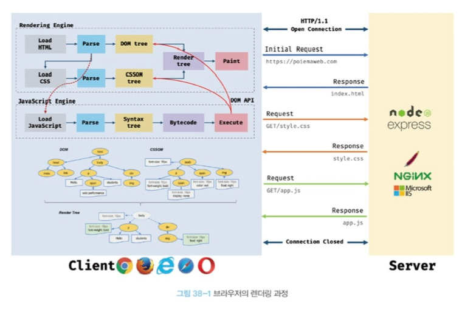
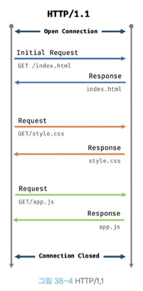
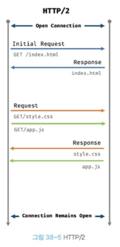

# 브라우저의 렌더링 과정

1. 브라우저는 HTML, CSS, 자바스크립트, 이미지, 폰트 파일 등 렌더링에 필요한 리소스를 요청하고 서버로부터 응답받는다.
2. 브라우저의 렌더링 엔진은 서버로부터 응답된 HTML과 CSS를 파싱하여 DOM과 CSSOM을 생성하고 이들을 결합하여 렌더 트리를 생성한다.
3. 브라우저의 자바스크립트 엔진은 서버로부터 응답된 자바스크립트를 파싱하여 AST를 생성하고 바이트코드로 변환하여 실행한다. 이때 자바스크립트는 DOM API를 통해 DOM이나 CSSOM을 변경할 수 있다. 변경된 DOM과 CSSOM은 다시 렌더 트리로 결합된다.
4. 렌더 트리를 기반으로 HTML 요소의 레이아웃(위치와 크기)을 계산하고 브라우저 화면에 HTML 요소를 페인팅한다.

---
# URI

서버에 요청을 전송하기 위해 브라우저는 주소창을 제공한다.

```
https://www.mydomain.com:80/docs/search?category=javascript&lang-ko#intro
```
위 URI(Uniform Resource Identifier)의 구성은 다음 처럼 나타낼 수 있다.
- Scheme(Protocol) : https
- Host(Domain) : www.mydomain.com
- Port : :80
- Path : /docs/search
- Query(Query String) : ?category=javascript&lang=ko
- Fragment : #intro

```
URL : Schmeme + Host + Port + Path
URN : Host + Port + Path + Query + Fragment
```
※ 굳이 주소창을 통해서만 서버에게 정적 파일만을 요청할 수 있는 것은 아니다. 자바스크립트를 통해("ajax", "REST API") 동적으로 서버에 정적/동적 데이터를 요청할 수도 있다.

**브라우저의 렌더링 엔진이 HTML(index.html)을 파싱하는 도중에 외부 리소스를 로드하는 태그, 즉 CSS파일을 로드하는 link 태그, 이미지 파일을 로드하는 img 태그, 자바스크립트를 로드하는 script 태그 등을 만나면 HTML의 파싱을 일시 중단하고 해당 리소스 파일을 서버로 요청한다.**

---
# HTTP 1.1과 HTTP 2.0
<div style="text-align:center"></div>

HTTP/1.1은 기본적으로 커넥션당 하나의 요청과 으답만 처리한다.  
즉, 여러 개의 요청을 한 번에 전송할 수 없고 응답 또한 마찬가지다. 따라서 HTML 문서 내에 포함된 여러 개의 리소스 요청, 즉 CSS 파일을 로드하는 link 태그, 이미지 파잉을 로드하는 img 태그, 자바스크립트를 로드하는 script 태그 등에 의한 **리소스 요청이 개별적으로 전송되고 응답 또한 개별적으로 전송**된다.

<div style="text-align:center"></div>

HTTP/2는 커넥션당 여러 개의 요청과 응답, 즉 다중 요청/응답이 가능하다. 따라서 HTTP/2.0은 여러 리소스의 동시 전송이 가능하므로 HTTP/1.1에 비해 페이지 로드 속도가 약 50% 정도 빠르다고 알려져 있다.
---
# HTML 파싱과 DOM 생성
1. 서버에 존재하던 HTML파일이 브자우저의 요청에 의해 응답된다. 이때 서버는 브라우저가 요청한 HTML 파일을 읽어 들여 메모리에 저장한 다음 메모리에 저장된 바이트를 인터넷을 경유하여 응답한다.
2. 브라우저는 서버가 응답한 HTML 문서를 바이트 형태로 응답받는다. 그리고 응답된 바이트 형태의 HTML 문서는 meta 태그의 charset 어트리뷰트에 의해 지정된 인코딩 방식을 기준으로 문자열로 변환된다. 참고로 meta 태그의 charset 어트리뷰트에 의해 지정된 인코딩 방식은 **content-type : text/html; charset=utf-8**과 같이 응답 헤더(response header)에 담겨 응답된다. 브라우저는 이를 확인하고 문자열로 변환한다.
3. 문자열로 변환된 HTML 문서를 읽어 들여 문법적 의미를 갖는 코드의 최소 단위인 토큰(token)들로 분해한다.
4. 각 토큰들을 객체로 변환하여 노드들을 생성한다. 토큰의 내용에 따라 문서 노드, 요소 노드, 어트리뷰트 노드, 텍스트 노드가 생성된다. 노드는 이후 DOM을 구성하는 기본 요소가 된다.
5. HTML 문서는 HTML 요소들의 집합으로 이루어지면 **HTML 요소는 중첩 관계를 갖는다.** 즉, HTML 요소의 콘텐츠 영역(시작 태그와 종료 태그 사이)에는 텍스트뿐만 아니라 다른 HTML 요소도 포함될 수 있다. 이때 HTML 요소 간에는 중첩 관계에 의해 부자 관계가 형성된다. 이러한 HTML 요소 간의 부자 관계를 반영하여 모든 노드들을 트리 자료구조로 구성한다. 이 노드들로 구성된 트리 자료구조를 DOM이라고 부른다.

**DOM은 HTML 문서를 파싱한 결과물이다.**

---
# CSS 파싱과 CSSOM 생성
렌더링 엔진은 DOM을 생성해 나가다가 CSS를 로드하는 link 태그나 style 태그를 만나면 DOM 생성을 일시 중단한다.  
그리고 link 태그의 href 어트리뷰트에 지정된 CSS 파일을 서버에 요청하여 로드한 CSS 파일이나 style 태그 내의 CSS를 HTML과 동일한 파싱 과정(바이트 -> 문자 -> 토큰 -> 노드 -> CSSOM)을 거치며 해석하여 CSSOM(CSS Object Model)을 생성한다.

---
# 그 외에 알아둬야 할 것

렌더트리 : DOM과 CSSOM이 렌더링을 위해 서로 결합된 트리  
  
자바스크립트 파싱과 실행은 브라우저의 렌더링 엔진이 아닌 자바스크립트 엔진이 처리한다. 렌더링 엔진으로부터 제어권을 넘겨받은 자바스크립트 엔진은 자바스크립트 코드를 파싱하기 시작한다. 렌더링 엔진이 HTML과 CSS를 파싱하여 DOM과 CSSOM을 생성하듯이 자바스크립트 엔진은 자바스크립트를 해석하여 AST(Abstract Syntax Tree)를 생성한다. 그리고 AST를 기반으로 인터프리터가 실행 할 수 있는 중간코드(intermediate code)인 바이트코드를 생성하여 실행한다.  
  
HTML 파싱은 렌더링 엔진이, 자바스크립트 파싱은 자바스크립트 엔진이 담당하지만 대부분의 웹 브라우저는 싱글 스레드 환경에서 동작하기 때문에 자바스크립트 파싱에 의해 HTML 파싱이 중단된다. 
따라서 효율적으로 페이지를 로드하기 위해서는 **async, defer** 속성을 사용하여 자바스크립트 파일의 로드를 비동기적으로 진행하는 것이 좋다.
  
리플로우 : 레이아웃계산을 다시하는 것. 노드 추가/삭제, 요소의 크기/유ㅣ치 변경, 윈도우 리사이징 등 레이아웃에 영향을 주는 변경이 발생한 경우에 한하여 실행된다.  
리페인트 : 재결합된 렌더 트리를 기반으로 다시 페인트를 하는 것을 말한다.

※ 항상 리플로우와 리페인트가 반드시 같이 일어나는 것은 아니다.