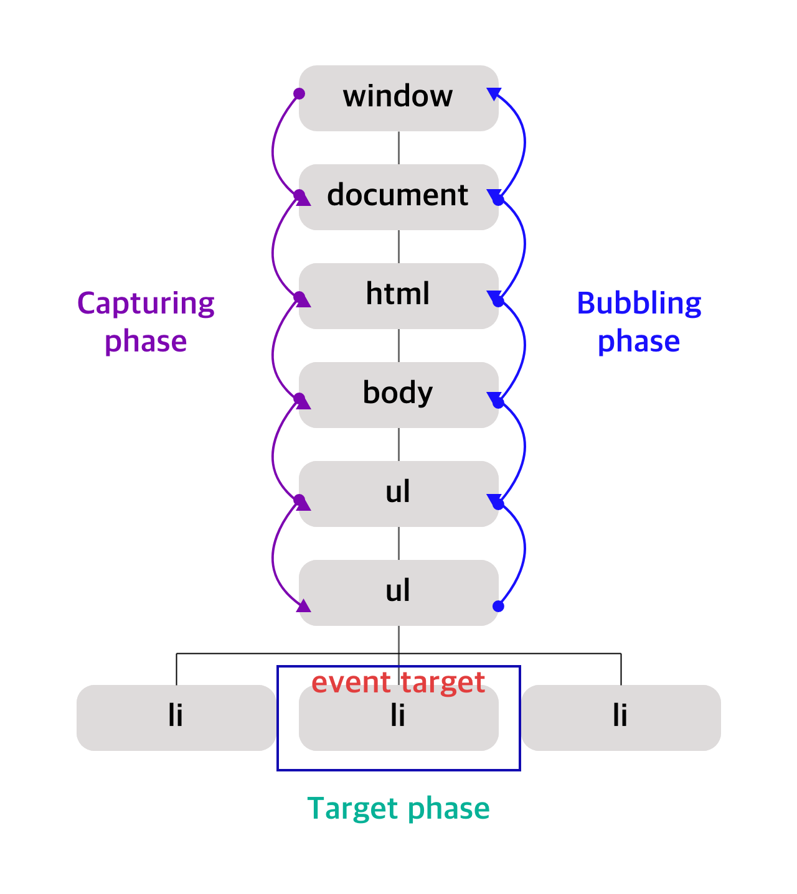

# 이벤트

# ✅ 이벤트 드리븐 프로그래밍

브라우저는 처리해야 할 특정 사건이 발생하면 이를 감지하여 이벤트를 발생시킨다. (키보드 입력, 마우스 입력 등)

만약 애플리케이션이 특정 타입의 이벤트에 대해 반응하여 어떤 일을 하고 싶다면 해당하는 타입의 이벤트가 발생했을 때, 호출될 함수를 브라우저에게 알려 호출을 위임한다.

- 이벤트 핸들러
    - 이벤트가 발생했을 때 호출될 함수
- 이벤트 핸들러 등록
    - 이벤트가 발생했을 때 이벤트 핸들러의 호출을 위임하는 것.
- 이벤트 드리븐 프로그래밍
    - 프로그램의 흐름을 이벤트 중심으로 제어하는 프로그래밍 방식

# ✅ 이벤트 타입

- 마우스 이벤트
- 키보드 이벤트
- 포커스 이벤트
- 폼 이벤트
- 값 변경 이벤트
- DOM 뮤테이션 이벤트
- 뷰 이벤트
- 리소스 이벤트

# ✅ 이벤트 핸들러 등록 방식

- 이벤트 핸들러 어트리뷰트 방식
    
    ```html
    <!Doctype html>
    <html>
    <head>
    
    </head>
    <body>
    	<button onClick="sayHi('Lee')"></button>
    
    </body>
    
    <script>
    	const sayHi = (name) => {
    		console.log("Hi", name);
    	}
    </script>
    </html>
    ```
    
    - 해당 방식은 HTML과 자바스크립트의 관심사 분리를 위해 분리하는 것이 좋다.
- 이벤트 핸들러 프로퍼티 방식
    
    ```html
    <!Doctype html>
    <html>
    <head>
    
    </head>
    <body>
    	<button onClick="sayHi('Lee')"></button>
    
    </body>
    
    <script>
    	const $btn = document.getQuerySelector("button");
    
    	$btn.onclick = (event) => {
    		console.log("button click");
    	}
    </script>
    </html>
    ```
    
- addEventListener 메서드 방식
    
    ```html
    <!Doctype html>
    <html>
    <head>
    
    </head>
    <body>
    	<button onClick="sayHi('Lee')"></button>
    
    </body>
    
    <script>
    	const $btn = document.getQuerySelector("button");
    
    	$btn.addEventListener("click", function(e) {
    		console.log("btn click!!");
    	});
    </script>
    </html>
    ```
    
    - addEventListener 메서드를 사용하면 요소에서 발생한 동일한 이벤트에 대해 하나 이상의 이벤트 핸들러를 등록할 수 있다. (등록한 순서대로 호출.)

# ✅ 이벤트 핸들러 제거 방식

- removeEventListener(event, callback)
    - addEventListener(evnet, callback) 를 통해 등록된 이벤트 핸들러를 제거할 때 사용하는 메서드.
    - 인수로 전달한 callback 과 동일한 이름의 이벤트 핸들러 함수를 제거한다. 이떄 이벤트 핸들러의 참조를 변수나 자료구조에 저장하고 있어야 한다.

# ✅ 이벤트 객체

이벤트가 발생하면 이벤트에 관련한 다양한 정보를 담고 있는 이벤트 객체가 동적으로 생성된다. (이는 이벤트 핸들러의 첫 번째 인수로 전달된다.)

이벤트 핸들러 어트리뷰트 방식의 경우, 첫 번째 매개변수의 이름이 반드시 event 이여야 한다.

```html
<!Doctype html>
<html>
<head>

</head>
<body>
	<button onClick="sayHi(event)"></button>
</body>

<script>
	const $btn = document.getQuerySelector("button");

	$btn.addEventListener("click", function(e) {
		console.log(e);
	});
</script>
</html>
```

- 이벤트 객체의 공통 프로퍼티
    - `type` - 이벤트 타입
    - `target` - 이벤트를 발생시킨 DOM 요소
    - `currentTarget` - 이벤트 핸들러가 바인딩 된 DOM 요소
    - `eventPhase` - 이벤트 전파 단계 (0 : 캡쳐링, 1 : 타깃, 2 : 버블링)
    - `bubbles` - 이벤트를 버블링으로 전파하는지 여부.
    - `cancelable` - preventDefault 메서드를 호출하여 이벤트의 기본 동작을 취소할 수 있는지 여부.
    - `defaultPrevented` - preventDefault 메서드를 호출하여 이벤트를 취소했는지 여부.
    - `isTrusted` - 시용자의 행위에 의해 발생한 이벤트인지.
    - `timeStamp` - 이벤트가 발생한 시각

# ✅ 이벤트 전파

DOM 트리 상에 존재하는 DOM 요소 노드에서 발생한 이벤트는 DOM 트리를 통해서 전파된다. 이를 **이벤트 전파**라고 한다. 아래 코드를 보자.

```html
<!Doctype html>
<html>
<head>

</head>
<body>
	<ul id="fruits">
		<li id="apple">Apple</li>
		<li id="banana">Banana</li>
		<li id="orange">Orange</li>
	</ul>
</body>
</html>
```

만약 ul 요소의 두 번째 자식 요소인 li를 클릭하면 클릭 이벤트가 발생한다고 했을 때, 생성된 이벤트 객체는 이벤트를 발생시킨 DOM 요소인 eventTarget을 중심으로 DOM 트리를 통해 전파된다.



이벤트 전파

- 이벤트 캡쳐링 단계
    - 이벤트가 상위 요소에서 하위 요소 방향으로 전파된다.
- 이벤트 타깃 단계
    - 이벤트가 이벤트 타깃에 도달한다.
- 이벤트 버블링 단계
    - 이벤트가 하위 요소에서 상위 요소 방향으로 전파된다.

# ✅ 이벤트 위임

어떤 요소의 자식 요소가 다수일 때, 반복문을 통해서 각 요소에 이벤트 핸들러를 등록하는 방법을 사용하는 대신에 상위 요소에 이벤트를 등록하는 것을 이벤트 위임이라고 한다. (이는 이벤트 전파에서 살펴본 이벤트 버블링을 통해 동작한다.)

# ✅ DOM 요소의 기본 동작 조작

- DOM 요소의 기본 동작 중단
    - DOM 요소는 저마다 기본 동작이 있다. 예를 들어 a 요소를 클릭하면 href 어트리뷰트에 지정된 링크로 이동하고, checkbox 또는 radio 요소를 클릭하면 체크 또는 해제된다.
    - 이벤트 객체의 `preventDefault()` 메서드는 이러한 DOM 요소의 기본 동작을 중단시킨다.
- 이벤트 전파 방지
    - 이벤트 객체의 `stopPropagation()` 메서드는 이벤트 전파를 중지시킨다.

# ✅ 이벤트 핸들러 내부의 this

- 이벤트 핸들러 어트리뷰트 방식에서의 `this`
    - 전역 객체 `window`를 가리킨다.
- 이벤트 핸들러 프로퍼티 방식과 `addEventListener` 메서드 방식에서의 `this`
    - 이벤트를 바인딩한 `DOM` 요소를 가리킨다.
    - BUT 화살표 함수로 정의한 이벤트 핸들러 내부의 `this`는 상위 스코프의 `this`를 가리킨다 (화살표 함수는 자체의 `this` 바인딩을 갖지 않는다.)